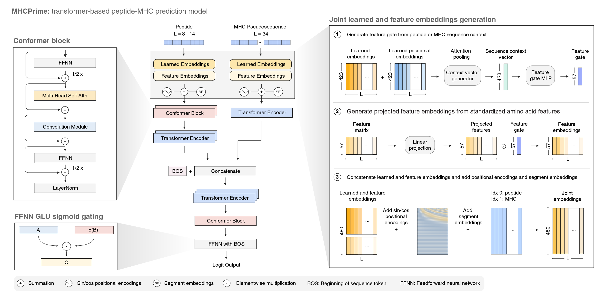

# MHCPrime

[](https://github.com/ntranoslab/MHCPrime/actions/workflows/tests.yml)

[](https://colab.research.google.com/github/ntranoslab/MHCPrime/blob/main/notebooks/01_inference_quickstart.ipynb)

MHCPrime is a transformer-based peptide-MHC class I prediction model. This package provides a pretrained default checkpoint, packaged MHC pseudosequences, example datasets, Python inference functions, and a command-line predictor.



## Installation

Clone the repository and install in editable mode:

```bash
git clone https://github.com/ntranoslab/MHCPrime.git
cd MHCPrime
python -m pip install -e .
```

MHCPrime uses PyTorch for model inference. The installation command above installs the package dependencies defined in pyproject.toml. For GPU inference, run MHCPrime inside an environment with a CUDA-compatible PyTorch installation. If CUDA is not available, MHCPrime will run on CPU.

The default MHCPrime base checkpoint is included with the package and is loaded automatically. No separate checkpoint download is required for standard inference.

## Quick command-line prediction

Run MHCPrime on the packaged small example dataset:

```bash
mhcprime-predict src/mhcprime/data/ms_test_data_small.csv.gz \
  --output outputs/ms_test_data_small_scored.csv.gz
```

The command creates the `outputs/` directory if needed and writes the scored dataframe to:

```text
outputs/ms_test_data_small_scored.csv.gz
```

By default, `mhcprime-predict`:

* loads the packaged MHCPrime base checkpoint,
* preprocesses the input dataframe,
* runs fast cached inference,
* adds an `mhcprime` score column,
* adds an `mhcprime_rank` global percentile-rank column,
* removes internal preprocessing columns from the output.

If the output file already exists, the command will ask before overwriting. To overwrite without prompting:

```bash
mhcprime-predict src/mhcprime/data/ms_test_data_small.csv.gz \
  --output outputs/ms_test_data_small_scored.csv.gz \
  --overwrite
```

For the larger packaged example dataset:

```bash
mhcprime-predict src/mhcprime/data/ms_test_data_large.csv.gz \
  --output outputs/ms_test_data_large_scored.csv.gz \
  --batch-size 3072 \
  --num-workers 8 \
  --overwrite
```

## Input format

The input file should be a csv/csv.gz or tsv/tsv.gz file with at least:

```text
seq,allele
```

A `label` column is optional. If absent, MHCPrime adds `label=0` internally.

Example:

```text
seq,allele,label
SLYNTVATL,A0201,1
GILGFVFTL,A0201,1
AAAAAAAAA,A0201,0
```

Alleles should be provided in MHCPrime format, for example:

```text
A0201
A0301
B0702
C0702
```

Peptides should be 8–14 amino acids. Optional flank columns can be provided as:

```text
n_flank,c_flank
```

If flank columns are absent, empty flanks are used.

## Output format

The default output is a clean, user-facing dataframe. For a basic input with `seq`, `allele`, and `label`, the output includes:

```text
seq
allele
label
mhcprime
mhcprime_rank
```

The `mhcprime` column contains the raw model score. The `mhcprime_rank` column contains the global percentile rank against the packaged MHCPrime background score distribution, where higher values indicate higher-ranking peptides.

Internal model columns such as `mhc_a_1`, `mhc_b_1`, `mhc_c_1`, and `sa_ma` are removed by default.

## Python usage

```python
import pandas as pd
import torch

from mhcprime import load_example_dataset, load_mhcprime_model, predict_dataframe

device = torch.device("cuda" if torch.cuda.is_available() else "cpu")

model, tokenizer, model_params = load_mhcprime_model(
    device=device,
    eval_mode=True,
)

df = load_example_dataset("small")

scored_df = predict_dataframe(
    model=model,
    df=df,
    tokenizer=tokenizer,
    score_col="mhcprime",
    mode="fast",
    device=device,
)

scored_df.head()
```

To load the larger packaged example dataset:

```python
df = load_example_dataset("large")
```

## Inference notebook

An example inference notebook is provided in the `notebooks/` directory. It demonstrates model loading, example dataset loading, fast and slow inference, score/rank inspection, and basic post-scoring summaries.

Recommended workflow:

```bash
jupyter notebook
```

Then open the inference notebook in:

```text
notebooks/
```

Model training is handled through the training script described below rather than through a notebook.

## Common CLI options

Use slow dataframe-based inference instead of cached fast inference:

```bash
mhcprime-predict src/mhcprime/data/ms_test_data_small.csv.gz \
  --output outputs/ms_test_data_small_scored_slow.csv.gz \
  --mode slow \
  --overwrite
```

Disable percentile-rank calculation:

```bash
mhcprime-predict src/mhcprime/data/ms_test_data_small.csv.gz \
  --output outputs/ms_test_data_small_scored_no_rank.csv.gz \
  --no-rank \
  --overwrite
```

Use a custom score column name:

```bash
mhcprime-predict src/mhcprime/data/ms_test_data_small.csv.gz \
  --output outputs/ms_test_data_small_scored_custom_col.csv.gz \
  --score-col my_model_score \
  --overwrite
```

Keep internal processed columns in the output:

```bash
mhcprime-predict src/mhcprime/data/ms_test_data_small.csv.gz \
  --output outputs/ms_test_data_small_scored_processed.csv.gz \
  --return-processed \
  --overwrite
```

Use a custom or fine-tuned checkpoint:

```bash
mhcprime-predict input.csv \
  --checkpoint path/to/custom_checkpoint.pt \
  --output outputs/custom_checkpoint_scored.csv \
  --score-col mhcprime_custom \
  --overwrite
```

## Device selection

By default, MHCPrime uses CUDA when available and otherwise falls back to CPU. GPU inference requires a CUDA-compatible PyTorch installation. To force a specific device:

```bash
mhcprime-predict input.csv \
  --output outputs/scored.csv \
  --device cuda \
  --overwrite
```

or:

```bash
mhcprime-predict input.csv \
  --output outputs/scored.csv \
  --device cpu \
  --overwrite
```

For environment debugging:

```bash
mhcprime-predict src/mhcprime/data/ms_test_data_small.csv.gz \
  --output outputs/debug_scored.csv.gz \
  --debug-env \
  --overwrite
```

## Training

Full MHCPrime training and test datasets are not stored directly in this GitHub repository because of file size. They can be downloaded from the [MHCPrime training/test data Google Drive folder](https://drive.google.com/drive/folders/1375azHSVJdbXN9qm6U_ht0mbhFbXDJBJ?usp=sharing).

After downloading, place the training/test data under:

```text
train_test_data/
```

For base MHCPrime training, the default expected training file is:

```text
train_test_data/ms_train_data.csv.gz
```

The base model can then be trained with:

```bash
python scripts/train_mhcprime_base.py --gpu 0
```

or, equivalently, with an explicit device:

```bash
python scripts/train_mhcprime_base.py --device cuda:0
```

Training outputs are written to:

```text
model_checkpoints/
```

By default, the training script uses the same base-training settings used for the released model:

```text
n_epochs = 120
batch_size = 3072
num_pos_per_epoch = 200,000
neg_pos_ratio = 1
loss_type = logsmoothap
loss_hp = 10.0
encoder_lr = 2e-4
decoder_lr = 2e-4
optimizer_type = AdamW
seed = 42
```

The default values can be changed from the command line. For example:

```bash
python scripts/train_mhcprime_base.py \
  --train-data train_test_data/ms_train_data.csv.gz \
  --run-name MHCPrime_Base \
  --device cuda:0 \
  --n-epochs 120 \
  --batch-size 3072 \
  --num-pos-per-epoch 200000 \
  --neg-pos-ratio 1 \
  --num-workers 16
```

To initialize training from an existing checkpoint rather than training from scratch:

```bash
python scripts/train_mhcprime_base.py \
  --train-data train_test_data/ms_train_data.csv.gz \
  --init-checkpoint src/mhcprime/checkpoints/mhcprime_base/model_final.pt \
  --run-name MHCPrime_Continued \
  --device cuda:0
```

This initializes model weights from the provided checkpoint and starts a new optimizer/scheduler run. It is not an exact optimizer-state resume.


## Notes

The packaged example datasets are intended for testing installation, inference, and output formatting. They are not intended to replace full benchmark evaluation.

For manuscript-scale benchmarking, users should evaluate on task-specific held-out datasets and background distributions appropriate to the biological application.

## License

This project is released under the MIT License. See the `LICENSE` file for details.

## Citation

Citation here later.